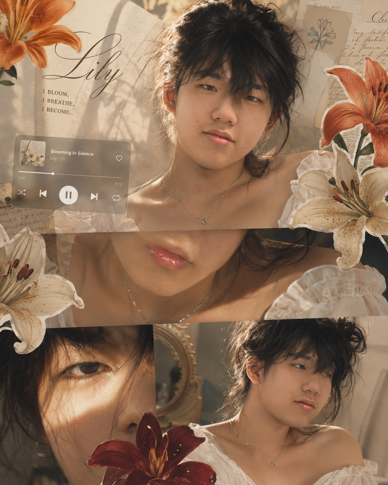
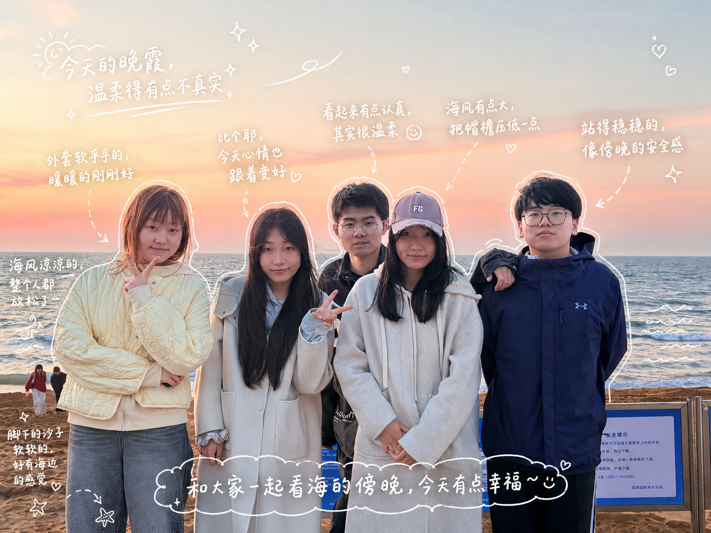
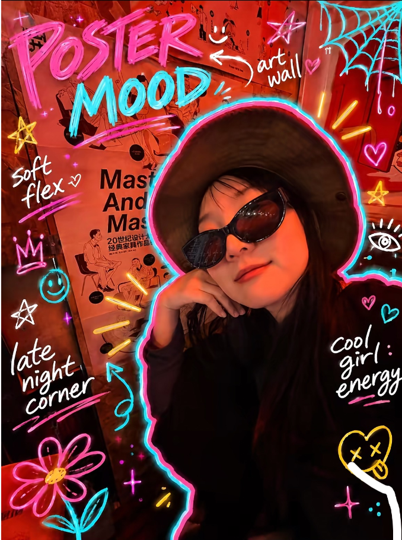
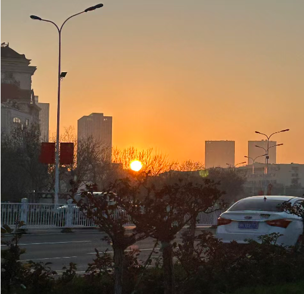
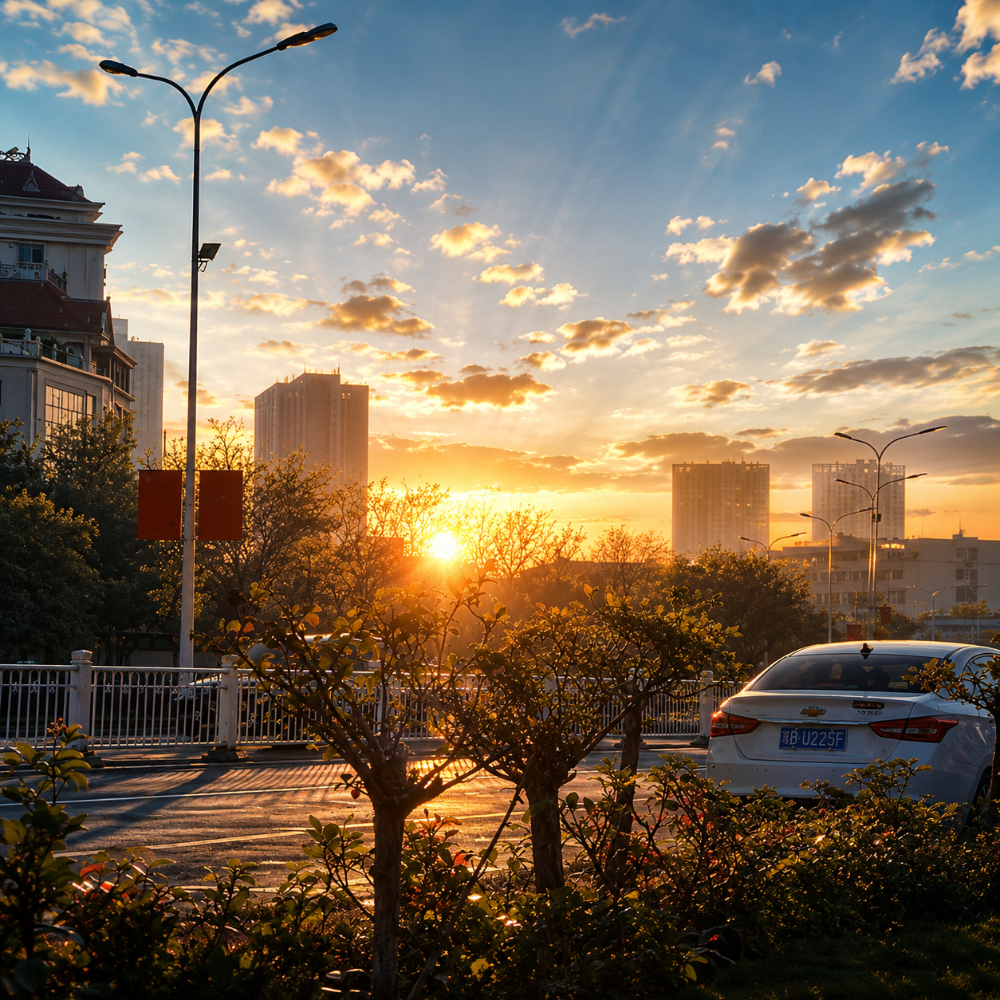

# 👩 人物风景P图 - 提示词合集

---
## 欧洲氛围感图片1

**提示词：**
以高级氛围感拼贴写真风格创作，整体画面柔和高级，带一点复古与精致感。人物造型为随性凌乱绑发，保留几缕自然垂落的碎发修饰脸部线条；水润玻璃唇，搭配细致淡眼线，皮肤呈现清透自然的奶油水光肌质感；佩戴一条精致细项链提升细节感；身穿白色露肩法式上衣；人物面部保留本身的长相特征
画面采用多面板重叠拼贴构图：
1。顶部主画面：人物正面直视镜头，眼神坚定，表情冷静高级，氛围感强。
2。中间特写：聚焦嘴唇与锁骨，项链的近距离细节，突出唇部光泽与首饰精致感。
3。左下角特写：极近距离眼部特写，利用明暗交界的光影切割脸部，营造电影感与神秘氛围。
4。右下角画面：人物微侧脸柔和凝视，自然放松，带一点慵懒又高级的氛围。
装饰元素：
加入橙色，奶油白，深红色百合花贴纸点缀画面边缘；在左侧偏中位置叠加一个半透明音乐播放器UI作为设计元素，整体像时尚杂志封面与拼贴风结合，细节精致，光线柔和温暖，高级，有故事感。

---
## 旅游标注图片1

**提示词：**
请观察照片中的元素、并为每个物件加上有意义的手绘风注解。请填写照片中的物品(例:披萨、汽水[描写规则】·使用像白色笔画的细线手绘线条·一笔画风格、随性、略带不均匀感·沿着物件外围加上描边轮廓·用箭头或虚线做出视线引导[文字规则】·手写风格字体(日系可爱感)·句子简短、像自言自语的小碎念·语气偏日记感、带一点情绪[注解生成规则】·饮料一>味道、温度、心情(例:清爽、微甜、刚刚好)·食物一>口感、好吃程度(例:松软、超好吃)·空间一>氛围(例:很放松、喜欢这种感觉)·整体一>一句总结(例:今天有点幸福~)[装饰)·适度加入热气、闪光、爱心、星星、小表情等元素。不要过度装饰，保留空白空间

---
## 创意自拍1

**提示词：**
 真实手持手机随拍快照风格，场景可为校园、画廊、工作室、咖啡馆、夜市或街头；主体为学生、艺术家、朋友或安静路人，背影或四分之三侧面，位于画面中心或偏右，正在看展、学习、走路、等待、浏览或拿笔记本、帆布袋、咖啡、手机、速写本等道具。整体略微倾斜、不完美构图，保留墙面艺术、标签、海报、货架、桌子、灯具、书籍、展示板、人群、织物、阴影、噪点、轻微模糊和不完美曝光。在照片上叠加非常强烈、密集、混乱的数字马克笔涂鸦：主体轮廓用亮粉色粗线勾勒，带青色偏移线条/光晕；主体周围向外放射黄橙尖刺、角、射线、鳍状物、太阳光芒般怪物形态。画面留白和四周加入大量粗糙手写文字，包括大标题/情绪标语、重复词、短笑话、日期标签、学习批注。再叠加丰富杂乱涂鸦符号：星星、爪印、蜘蛛网边角、光环、抽象眼睛、植物、花朵、爱心、箭头、计数符号、下划线、涂鸦条。线条风格粗厚数字马克笔、摇晃黑色轮廓、粗糙笔刷边缘、随意压力变化，有明显学生日记、杂志标记、社交媒体故事批注感。涂鸦层明显覆盖照片上方，可遮挡部分人物和物体，但底图仍清晰；整体气质俏皮、青春、走神、有点过度刺激、亲切又有个性，重点是霓虹、混乱、密集、夸张涂鸦覆盖效果。

 ---
## 风景高清化1
                         <><><><><><><>                     

**提示词：**
修改成3A游戏CG渲染风格景观，虚幻引擎5级画面质感，电影级光影表现，细节极度丰富真实，整体画面明亮通透，曝光充足偏高，色彩干净通透，高饱和自然，天空清澈通透纯净，云层桑软立体，具有明显层次感。清晰方向光，形成明显光影对比与长阴影，体积光清晰可见，增强空间纵深感，地面具有适度反光与高光点，增强画面质感但不过度湿润，远景空气透视明显，层次分明，整体画面干净清爽，高动态范围成像（HDR） 高光通透不死白，暗部干净不发灰，整体视觉具有轻微发光感，画面清晰锐利，真实且具有高级游戏质愿感生成图片

