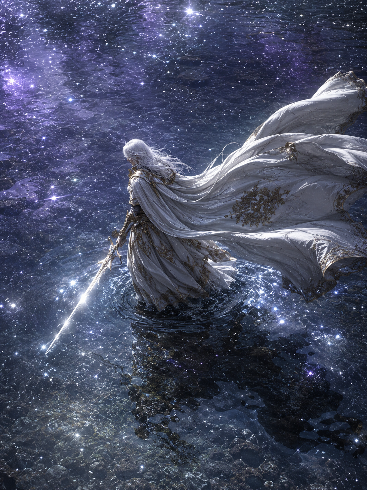
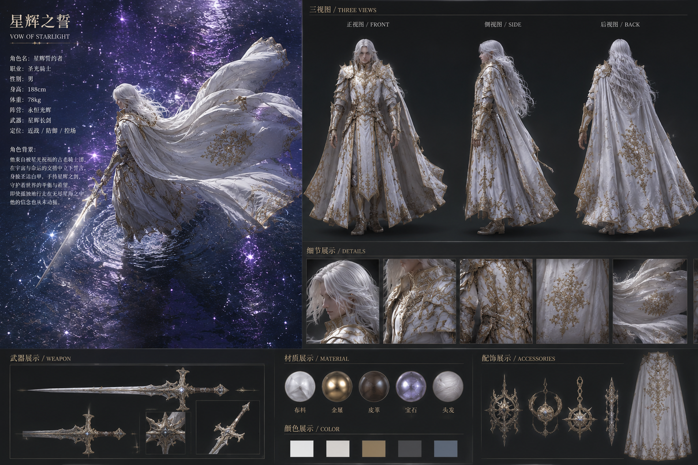
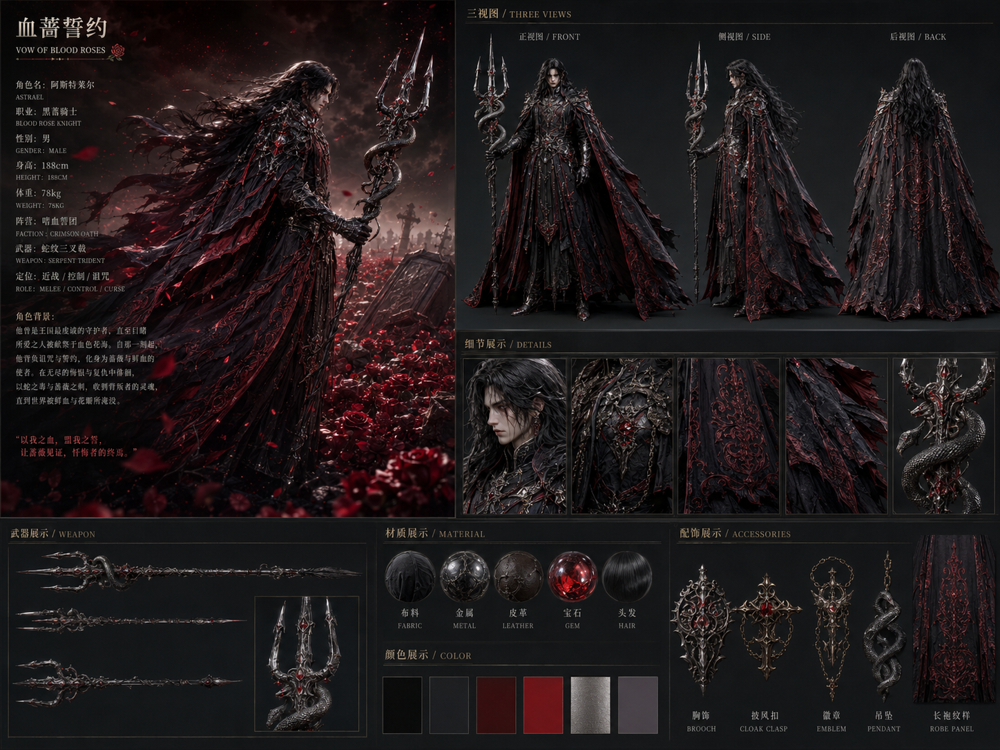
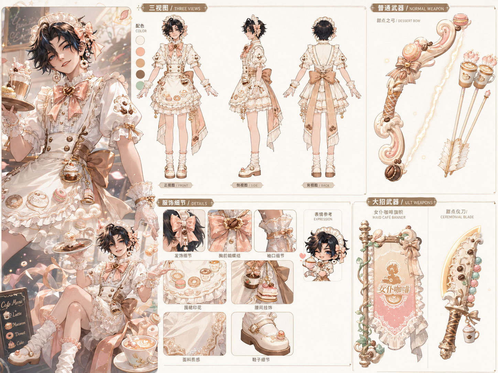

# 🎮 游戏UI - 提示词合集

---
## 风格化法环角色三视图1

**提示词：**
UE5高端实时渲染质感，一名身穿白色长裙配金色边缘花纹与白色厚重披风的骑士行走在一片浅水塘中，白色长发，侧方视角，朝向左边，身体微微前倾，单手持一把反射强烈光线的长剑；披风被强风掀起，形成大幅度、极具张力的动态形态。场景位于开阔浅水区域，水体清澈通透，水面如镜面般倒映出紫色星空，星辉与水波交织，营造出梦幻而神秘的氛围；浅水表面泛起柔和涟漪，并覆盖大量冷白色微光粒子，如星尘散落其上。画面采用高机位轻俯视，中远景构图，强烈光照与高对比暗部塑造出鲜明层次，微光散射增强空间纵深；整体采用电影级色彩分级，深红色服饰与紫色星空、水面冷调反光形成强烈视觉对比；材质超写实，布料厚重自然，金属盔甲与长剑反射真实细腻，水体透明感与反射效果极具真实感；8K，超高细节，史诗感、孤独感、梦境般氛围。

**跟进提示词：**
三视图：游戏人物三视图，包括人物所有信息

**同类型：**

UE5高端实时渲染质感，一名身穿黑色哥特长袍配红色边缘花纹与黑红厚重披风的哥特风格的骑士行走在一片玫瑰花丛中，黑色长发，侧方视角，朝向右边，身体微微前倾，单手持一杆缠绕毒蛇纹理的三叉长枪；披风被强风掀起，形成大幅度、极具张力的动态形态。场景位于开阔玫瑰花田区域，花朵鲜艳绽放，地面花丛依稀横躺着墓碑，棺材，血色与花朵交织，营造出恐怖而庄严的氛围；花朵表面泛起柔和涟漪，并覆盖大量血色微光粒子，如星尘散落其上。画面采用高机位轻俯视，中远景构图，强烈光照与高对比暗部塑造出鲜明层次，微光散射增强空间纵深；整体采用电影级色彩分级，黑色服饰与花海红色调反光形成强烈视觉对比；材质超写实，布料厚重自然，金属盔甲与武器反射真实细腻，人物与场景效果极具真实感；8K，超高细节，史诗感、孤独感、梦境般氛围。

---
## 王者荣耀自制皮肤三视图1

**提示词（需输入一张原图）：**
现在你是一位资深游戏角色海报设计师，你将为这位角色设计新皮肤，记住“新皮肤与原劈必须保持脸部特征相似，修改的地方可以是发型、动作、服饰、武器样式等”。皮肤设计理念： 一、核心风格 & 定调 定位：甜品咖啡店女仆主基调：奶油裱花、马卡龙渐变、奶泡拉丝、甜甜圈 / 拿铁小元素全覆盖设计原则：所有边角全部圆弧化，武器、服饰无锋利尖角，适配可爱人设 二、专属标准配色色卡 主色：奶油奶白、浅焦糖奶茶色 辅色：淡蜜桃粉、奶杏浅黄 点缀色：浅薄荷绿、糖霜白 特效色：暖奶泡柔光、浅金细闪 三、发型 & 头部配饰 发型：发尾微卷碎刘海，发丝带奶油渐变柔光 发饰： 蝴蝶结超大蓬松款 头顶简约蕾丝女仆发箍，边缘做奶油荷叶边 发箍两侧点缀迷你立体咖啡豆 + 小糖粒吊坠，小巧不浮夸 耳饰：小巧奶油甜甜圈造型耳钉 四、全身服饰精细化拆解 上衣 泡泡袖娃娃领女仆衫，领口多层奶油荷叶边，正中超大蜜桃粉 + 奶白拼接蝴蝶结；袖口宽松荷叶边，绣微型咖啡豆暗纹，袖口收口绑细焦糖丝带。 腰裙 & 围裙 高腰收腰设计，腰线绑宽版焦糖缎带，侧边垂落长飘带 百褶短裙：层叠奶油白荷叶裙摆，每层裙摆边缘刷浅焦糖糖霜描边 定制女仆围裙：奶白底，满印卡通迷你拿铁杯、甜甜圈、马卡龙小图案，围裙下摆波浪奶油花边，两角垂蕾丝细绳 下装 & 鞋袜 袜子：奶白色软糯堆堆袜，袜口蜜桃粉荷叶边 鞋子：圆头玛丽珍小皮鞋，奶油白鞋身、焦糖鞋底，鞋头点缀一颗立体仿真糖珠 配饰细节 短款蕾丝泡泡手套，指尖微透奶白质感 腰间侧边挂迷你立体小挂件：缩小版咖啡杯 + 小蛋糕吊坠 五、普通模式：奶油甜品风弓箭 超细化设计 弓身整体 造型：整体流线圆弧，没有硬棱角，马卡龙三色拼接 ——奶油白主体 + 浅焦糖描边 + 蜜桃粉内侧渐变 材质：仿奶油裱花哑光质感，表面有立体奶油拉丝纹路，像蛋糕裱花褶皱 弓柄：缠绕焦糖格纹缎带，握柄处做防滑软绒质感，底端镶嵌一颗圆润咖啡豆装饰 弓弦 不做普通绳线，做成蓬松棉花糖奶泡质感，半透奶白色，自带微弱暖光细闪 箭支设计 整支箭做成迷你外带拿铁纸杯造型： 箭身：奶白杯身，印简约咖啡拉花图案 箭头：圆润糖霜花造型，蜜桃粉渐变 箭尾：替换成奶油色羽毛，边缘撒浅金糖粒细闪 六、大招模式：旌旗 + 锭刀 双武器精细化 1. 甜品店主题旌旗 旗杆：原木奶杏质感，柱身缠绕浅薄荷绿藤蔓 + 小咖啡豆浮雕 旗面：马卡龙渐变底（奶白过渡蜜桃粉），卡通手绘风 印「女仆咖啡」专属招牌 logo + 蕾丝女仆剪影 + 拉花咖啡图案 旗边：多层奶油荷叶边镶边，垂挂半透奶白薄纱飘带，飘带随风有轻微奶泡流光 旌旗整体边角全部圆弧，旗帜褶皱柔和飘逸 2. 奶油风旌旗锭刀 保留原锭刀结构，但全部棱角圆润钝化，走甜品雕花感： 刀身：哑光奶油白底色，刀身刻糖霜拉丝、咖啡豆缠枝浮雕，纹路是浅焦糖色 刀刃：不做冷硬金属感，做暖奶金色柔光刃，无锋利锋芒 刀柄：绑焦糖格纹丝带，末端坠同款式小咖啡杯吊坠 刀鞘 / 刀背：点缀马卡龙小圆珠装饰，像蛋糕装饰糖珠 因为有两个形态，所以你在三视图的设定图里面需要专门给出两把武器的特写，图里面的文字不需要角色介绍，文字可以简单一点
