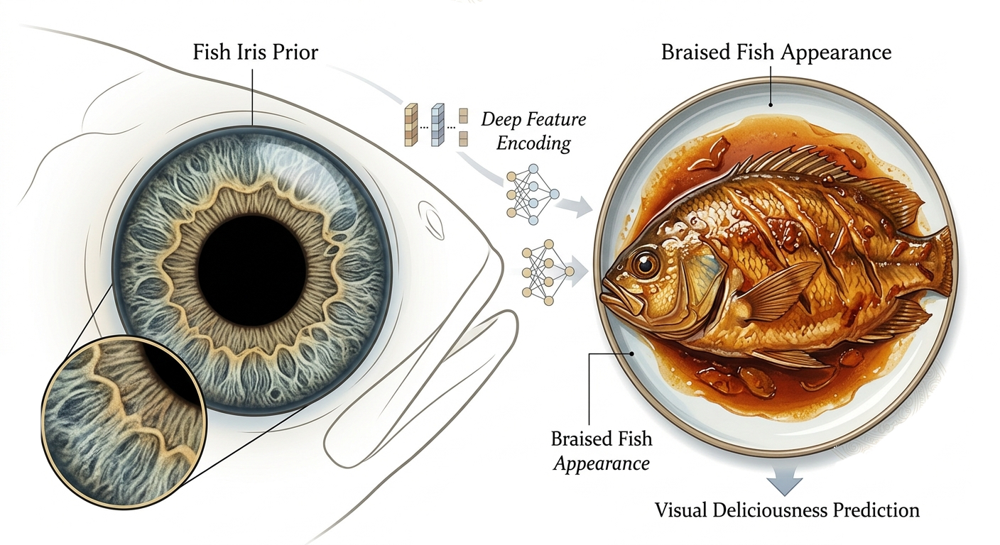

# 👩 论文用图 - 提示词合集

---
## 红烧电光美人鱼展示说明1

**正向提示词：**
为一篇关于煜烧电人鱼视觉美味预测的学术论文创建一个Nature风格的单一科学图形摘要，使用虹膜先验和深度特征编码。

整体风格
自然期刊风格
干净的白色背景
优雅、简约、具有出版质量的科学作文
高分辨率、精致、专业、视觉平衡
没有卡通风格，没有信息图商业风格，没有鲜艳的海报美学
该图应呈现为高水平科学论文的严肃跨学科研究概念图
使用克制、柔和、精致的色彩
细线条、细腻的标签、柔和的灰阶箭头、干净的学术排版
构图应当视觉上富有诗意，但同时严谨且科学
图形目的

该图应将以下四个科学理念视觉整合为一个统一的概念图像：

鱼既是食物，也是中国传统中具有文化意义的视觉对象
整条红烧鱼的外观会影响食欲判断和整体感知评估
虹膜是一种极具辨识性的生物特征，具有复杂且稳定的纹理
在深度特征编码之后，虹膜可以提升烩电鱼的视觉美味预测
创作

设计一幅多层次的概念科学插图，从左到右或中间辐射排列，并保持流畅的学术视觉流畅。

必备视觉元素
左侧部分：文化与烹饪背景
展示精致优雅的全鱼菜肴呈现
鱼应为炖煮整条鱼，质地光滑，质地丰富，色调温暖的红褐色到金棕色
构图应微妙地唤起中国烹饪美学的氛围
包含受中国传统丰盛与吉祥象征启发的细腻视觉元素
重要性：这些文化图案必须抽象且低调，如淡淡的云纹、圆形装饰框架，或细腻的红金装饰几何
不要让它变得节日、商业化或俗气
鱼类菜肴应呈现科学观察的效果，而非食品广告
中间部分：美味的视觉提示
在炖鱼周围，用优雅的极简标签和细致的标识线标示关键的视觉外观线索：
色彩色调
表面光泽
纹理细节
头部朝向
这些提示应以科学注释形式出现，而非信息图贴纸
使用克制、学术化的标签风格
上/右侧：虹膜前置
展示电美人鱼的放大虹膜图像
虹膜应呈现生物细节、质感、环状、高分辨率、科学感
鸢尾区应呈现为圆形作物或科学嵌入
从虹膜图像向计算编码过程添加微妙的过渡
计算编码部分
展示一个干净的深度学习概念流程：
虹膜图像
补丁分区或特征编码
类似变压器的深度特征表示
低维虹膜先嵌入
这个计算部分应简洁简洁，不能杂乱无章
编码应呈现严肃的机器学习工作流程，可能包含小巧优雅的特征块或令牌序列
避免过多文字，但视觉逻辑必须清晰
最右侧部分：预测目标
将最终输出作为科学预测目标显示：
“视觉美味预测”
直观地表示最终预测是通过以下组合生成：
菜肴外观信息
Iris之前的信息
这可以通过聚变节点或收敛箭头来表示
输出应以科学评分/回归目标或抽象预测模块的形式出现
科学氛围
整个图表应当感觉像是以下跨学科的融合：
食物感知科学
计算机视觉
生物识别
文化符号学
它应当优雅、概念坚实，适合作为《自然》风格的短文引言
文本元素

如有需要，只需使用少量干净的标签，例如：

文化背景
视觉线索
艾瑞斯·普赖尔
深度特征编码
视觉美味预测

不要在图片上大量使用文字。
文字应简约、含蓄且具出版风格。

视觉约束
没有卡通鱼
没有动漫
没有夸张的奇幻美人鱼设计
没有鲜艳的霓虹色
没有演示幻灯片的样子
没有低质量图标
没有剪贴画
没有食品广告风格
没有过度拥挤的布局
输出需求
仅限单面板
一个精致的概念科学示例
适合作为《自然》风格论文中的引言图或图形摘要
必须看起来像个高端学术概念人物
