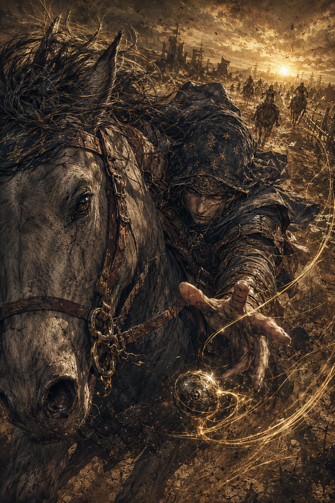

# ⚡ 雷霆炸裂图 - 提示词合集

---
## 沙海沉金

**提示词：**
Epic fantasy battle chase illustration, vertical composition, extreme dynamic perspective, close-up cinematic shot of a gray war horse and a mysterious rider charging forward at high speed. The horse’s huge head fills the left foreground, wearing worn leather reins, metal buckles, messy mane, realistic eye, dust and scratches. The rider leans low against the horse, reaching one hand toward the viewer, controlling a glowing metallic orb or magical pendulum with thin golden energy trails swirling around the scene.

The rider wears a weathered dark blue-gray cloak, star-patterned hood or headscarf, old leather armor, dusty fabric, metal ornaments, and rugged nomadic fantasy clothing. His face is partly shadowed, intense eyes, focused and dangerous expression, long fingers stretched forward, dramatic action pose. In the background, several distant horsemen are chasing across a vast barren battlefield, with dusty ground, dry grass, broken stones, old fences, ruined paths, and ancient silhouettes.

Low sunset light on the horizon, strong golden backlight, dramatic shadows, volumetric dust, atmospheric perspective, glowing magical trails, sense of speed and danger. Style: highly detailed fantasy concept art, classical engraving mixed with painterly oil texture, sepia and bronze color palette, rough parchment texture, intricate linework, scratchy hand-drawn details, dark gold, brown, gray-blue tones, cinematic lighting, epic lonely atmosphere, ultra detailed, 8K, masterpiece. old parchment fantasy illustration, scratchy ink linework, dense cross-hatching, weathered bronze monochrome palette, antique book cover texture, dusty battlefield atmosphere
