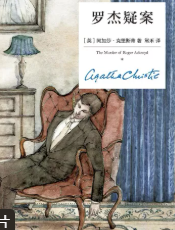
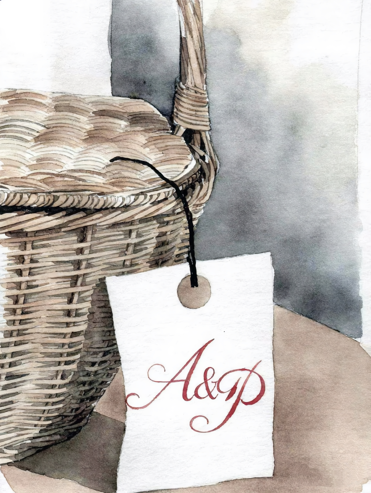
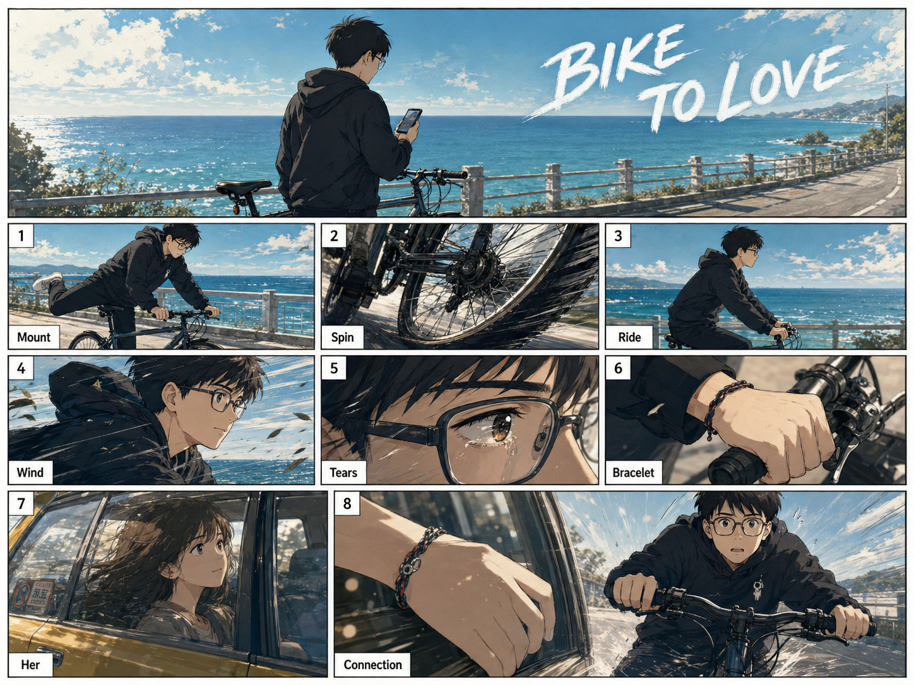
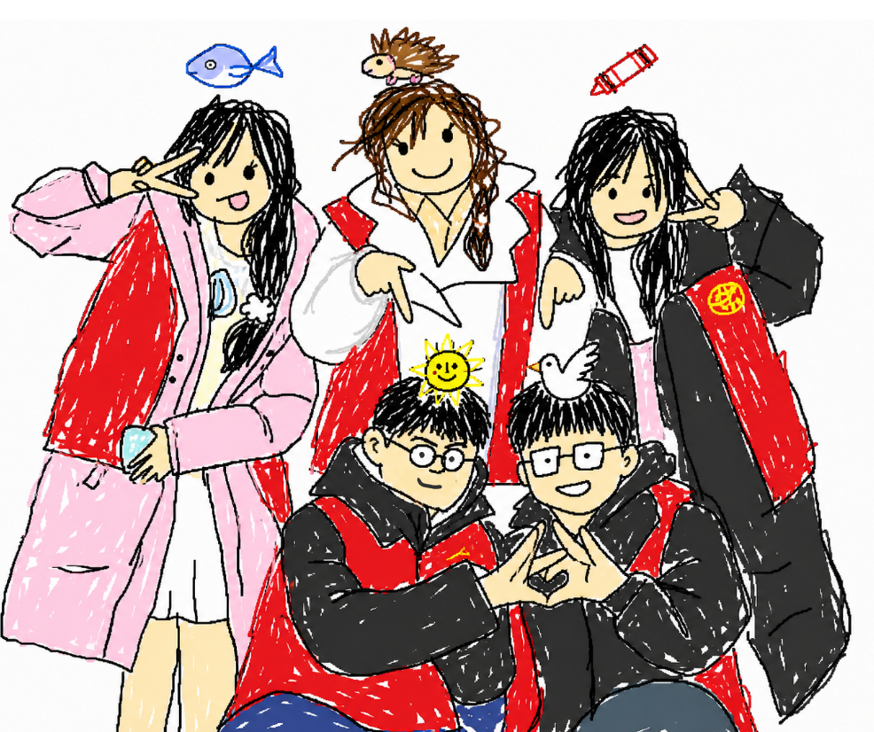

# 风格化杂图 - 提示词合集

## 课本水墨画风1
                   

**提示词：**
一本中文小说封面设计，竖版，画面为一个屋子内一张桌子，上面放着一个果篮，果篮盖子是关闭的，果篮的提手上用红字白纸写着一个花体字便条''A&P''。整体构图留有呼吸感，画面简洁、诗意、悬疑、优雅，具有小说封面的艺术性与辨识度。具有复古文学气质。技法与媒介：钢笔 / 墨水线稿 + 透明淡彩（水彩）手绘插画，以清晰灵动的轮廓线为骨架，叠加低饱和度、半透明的水彩晕染，带有明显的手绘水痕与色彩过渡质感。线条表现：松弛随性的手绘线条，带有复古蚀刻插画的速写感，轮廓柔和无硬边，兼具装饰性与手绘温度。整体气质：复古童话风、维多利亚式装饰插画气质，优雅、静谧、温柔中带有隐秘的不祥感，兼具怀旧绘本氛围与文学悬疑气息，高级艺术插画风，适合作为小说实体书封面。high detail, book cover illustration, vertical composition, elegant negative space, hand-drawn watercolor texture, vintage fairytale illustration, victorian decorative illustration, literary fiction cover, poetic and eerie, refined composition不要现代摄影风，不要3D渲染，不要塑料感，不要高饱和荧光色，不要卡通Q版，不要二次元萌系，不要恐怖猎奇，不要血腥飞溅，不要写实恐怖片海报感，不要杂乱背景，不要过多装饰元素，不要硬朗锐利边缘，不要数字感过强，不要金属质感，不要赛博朋克，不要强对比霓虹光，不要文字乱码。
左图仅作画风参考，内容不必参考。

---
## 窗格动画1
 

**提示词：**
生成一张电影感漫画分镜页，主题是“骑自行车”。 整体风格：新海诚电影感漫画，粗粝手绘线条，低饱和色彩，强烈明暗对比，户外阳光明媚，纪实摄影感，近景特写，手部动作突出。 版式：整张图是一页漫画分镜，共9个矩形画格，白色粗边框。第一格最大，作为标题画面；其余画格展示1到8步制作流程。每一格左上角有白色编号框，每一格都有小的白色说明框，文字简短清晰。 内容： 大标题：“Bike to love” 第一格：主角背身看手机 第1格：主角跨上自行车 第2格：自行车轮胎转动 第3格：侧面视角，主角海边骑自行车 第4格：大风吹主角 第5格：主角眼角泪花 第6格：主角手部特写手绳 第7格：主角女朋友坐出租车后座 第8格：女朋友手部特写手绳 最后小格：主角刹车 文字要求：只保留简短英文标签，字体清楚，不要乱码，不要长段文字。 主角形象参考【给他参考图】

---
## 窗格动画1
 

**提示词：**
Redraw the attached image in the most clumsy, scribbly, and utterly pathetic way possible. Use a white background, and make it look like it was drawn in MS Paint with a mouse. It should be vaguely similar but also not really, kind of matching but also off in a confusing, awkward way, with that low-quality pixel-by-pixel feel that really emphasizes how ridiculously bad it is. Actually, you know what, whatever, just draw it however you want.
